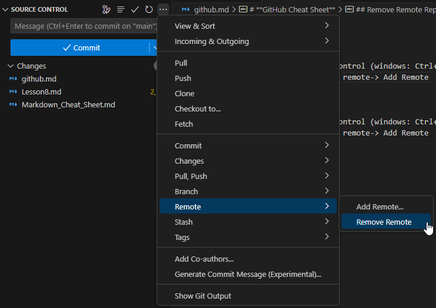
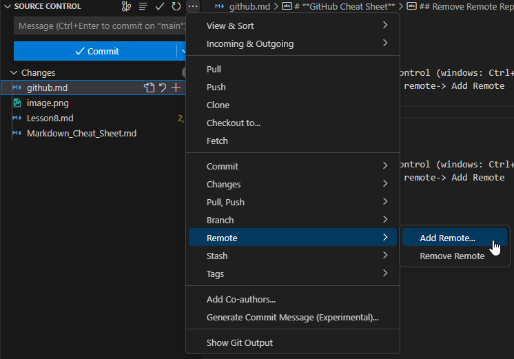

# **GitHub Cheat Sheet**

## Remove Remote Repo

1. In VScode select source control (windows: Ctrl+Shift+G G)
2. From the drop down select remote-> Remove Remote

## Add Remote Repo

1. Navigate to [GitHub](github.com)
2. Create new repository with unique name
3. Copy new repository ssh link
4. In VScode select source control (windows: Ctrl+Shift+G G)
5. From the drop down select remote-> Add Remote
6. Paste ssh repository link
7. Give name for link to repository to be idenitified by VScode

